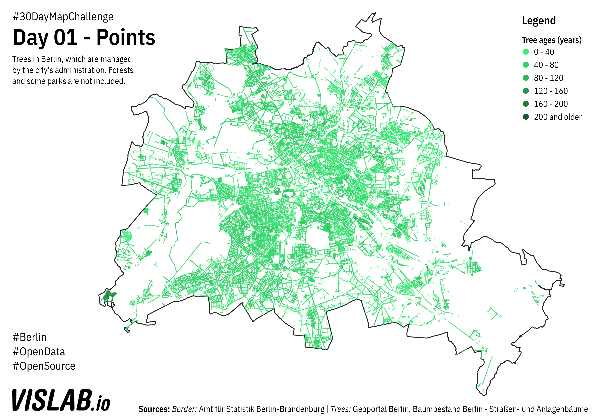

# Day 01 - Polygons
Trees of Berlin

## Sources

### Trees

https://fbinter.stadt-berlin.de/fb/wfs/data/senstadt/s_wfs_baumbestand_an
https://fbinter.stadt-berlin.de/fb/wfs/data/senstadt/s_wfs_baumbestand

DL-DE-BY-2.0: Geoportal Berlin, Baumbestand Berlin - Straßenbäume

### Berlin border

https://fbinter.stadt-berlin.de/fb/wfs/data/senstadt/s_lor_bez

Der Datenbestand wird unter der Lizenz CC-BY-3.0-Namensnennung veröffentlicht (vgl. https://creativecommons.org/licenses/by/3.0/de/). Als Urheber ist dabei zu nennen: Amt für Statistik Berlin-Brandenburg

## Related Project
https://www.giessdenkiez.de
https://github.com/technologiestiftung/giessdenkiez-de