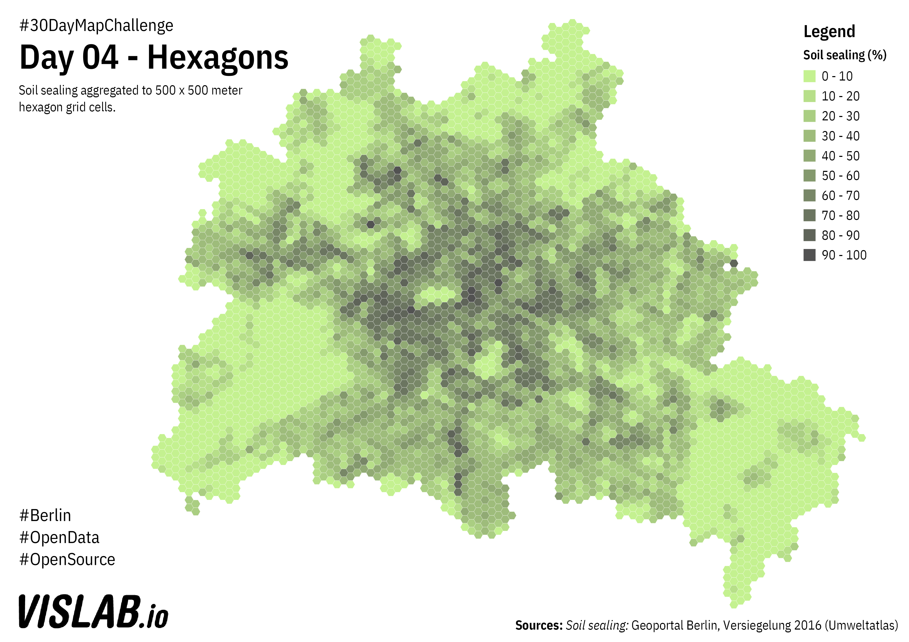

# Day 04 - Hexagons
Soil sealing



## Sources

### Soil Sealing

https://fbinter.stadt-berlin.de/fb/wfs/data/senstadt/sach_nutz2015_nutzsa

DL-DE-BY-2.0: Geoportal Berlin, Baumbestand Berlin - Straßenbäume

## Processing

For faster processing (sorry QGIS) i imported a QGIS-generated hex-grid and the soil sealing polygons into a postgres database, added spatial indices and ran the following query:

```
WITH calculation AS (
    SELECT temp.id, SUM(temp.vg_area) / SUM(temp.area) AS soil_sealing FROM (
	    SELECT
		    grid.id AS id,
		    wfs_sealing.vg / 100 * ST_Area(ST_Intersection(grid.geom, wfs_sealing.geom)) AS vg_area,
		    ST_Area(ST_Intersection(grid.geom, wfs_sealing.geom)) AS area
  	    FROM grid
  	    JOIN wfs_sealing ON ST_Intersects(grid.geom, wfs_sealing.geom)
    ) AS temp
    GROUP BY temp.id
)
UPDATE
    grid
SET
    soil_sealing = calculation.soil_sealing
FROM
    calculation
WHERE
    grid.id = calculation.id
```