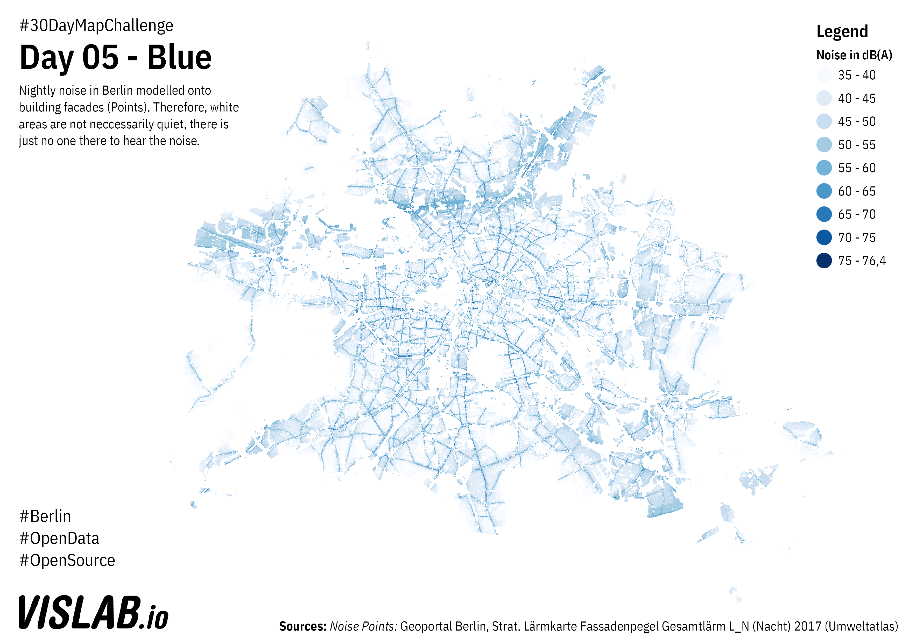

# Day 05 - Blue
Nighttime noise in Berlin

## Sources

### Noise Points

ttps://fbinter.stadt-berlin.de/fb/feed/senstadt/a_07_05_11fassadpeg
https://fbinter.stadt-berlin.de/fb/atom/strat_laerm/FP_2017.zip

DL-DE-BY-2.0: Geoportal Berlin, Strat. Lärmkarte Fassadenpegel Gesamtlärm L_N (Nacht) 2017 (Umweltatlas)