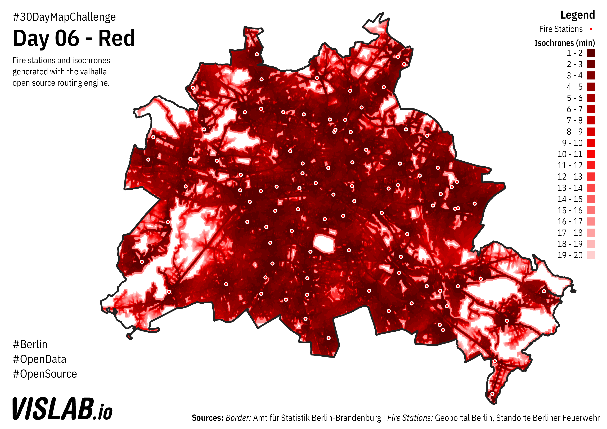

# Day 06 - Red
Fire departments and isochrones in minutes

The isochrones were generated through the valhalla routing engine: https://github.com/valhalla/valhalla
The batch generation of isochrones is done in the index.js in this folder. The Polygons generated by valhalla are not ideal. If using them in QGIS best run a "fix geometries" script.

## Sources

### Fire Stations

https://fbinter.stadt-berlin.de/fb/wfs/data/senstadt/s_feuerwehr

Geoportal Berlin / Standorte Berliner Feuerwehr