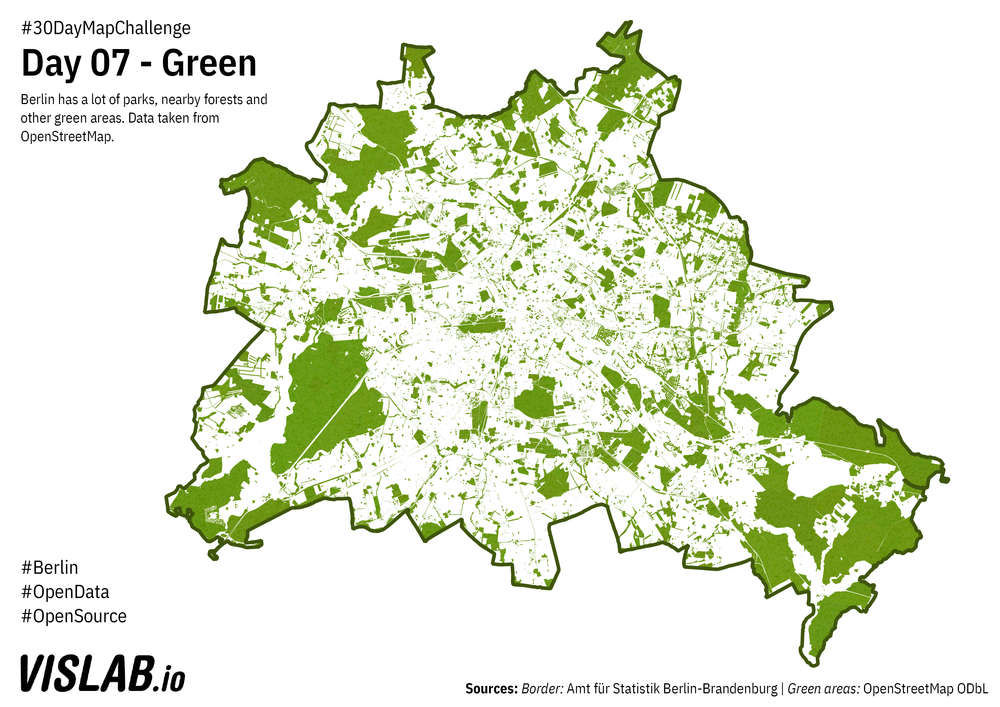

# Day 07 - Green
Green areas in Berlin taken from OpenStreetMap

OSM has a lot of green-related features. I wrote a quick script to generate the required OSM-Overpass queries (index.js) 

To make the map a little bit more visually interesting, i was exploring a way to use python to add noise to my polygons, but i gave up half way there and simply used gimp to generate some noise and added it as an additional texture.

## Sources

### Green Areas
OpenStreetMap (ODbL)