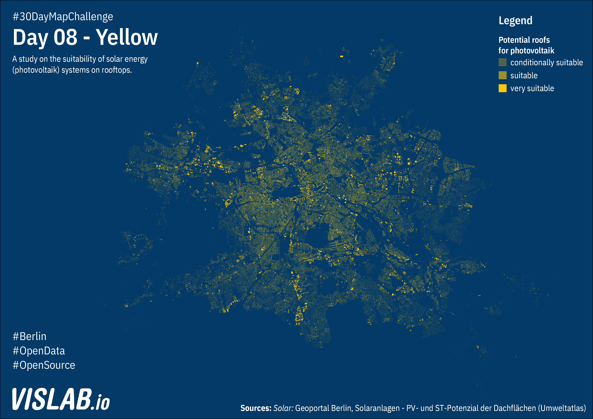

# Day 08 - Yellow
Photovoltaik potentials in Berlin

## Sources

### Solar

https://fbinter.stadt-berlin.de/fb/atom/solar/ST_PV_Potenzial_2013.zip
https://fbinter.stadt-berlin.de/fb/wfs/data/senstadt/s_feuerwehr

Geoportal Berlin / Solaranlagen - PV- und ST-Potenzial der Dachflächen (Umweltatlas)

## Related Project

https://energieatlas.berlin.de