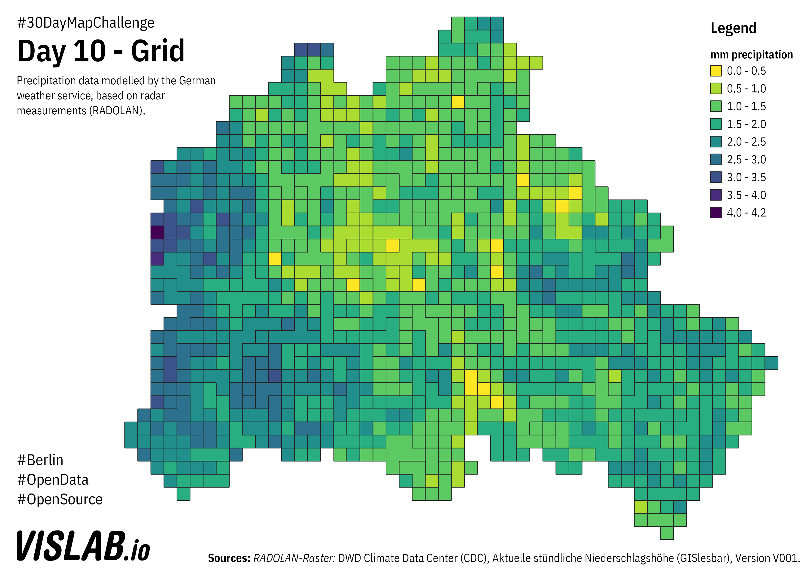

# Day 10 - Grid
Grid-based precipitation data from the German Weather Service (DWD). The data is derived from radar data.

Here is a python notebook for automatically processing the Radolan data: https://colab.research.google.com/drive/1tqc5jBqMXPdP6j1FjmJXkXEToJw9mgRo?usp=sharing

## Sources

### Raster Precipitation data

https://opendata.dwd.de/climate_environment/CDC/grids_germany/daily/radolan/
DWD Climate Data Center (CDC) Aktuelle stündliche Niederschlagshöhe (GISlesbar) Version V00001
