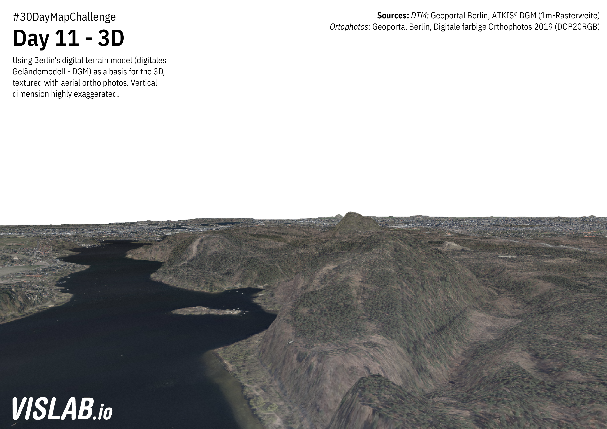

# Day 11 - 3D
Grid-based precipitation data from the German Weather Service (DWD). The data is derived from radar data.



## Sources

### Digital Terrain Model

https://fbinter.stadt-berlin.de/fb/feed/senstadt/a_dgm
Geoportal Berlin, ATKIS® DGM (1m-Rasterweite)

### Aerial Photography

https://fbinter.stadt-berlin.de/fb/feed/senstadt/a_luftbild2019_rgb
Geoportal Berlin, Digitale farbige Orthophotos 2019 (DOP20RGB)

```
gdalbuildvrt mosaic.vrt *.tif
gdal_translate -of GTiff -a_srs EPSG:4647 mosaic.vrt  merged.tif
```