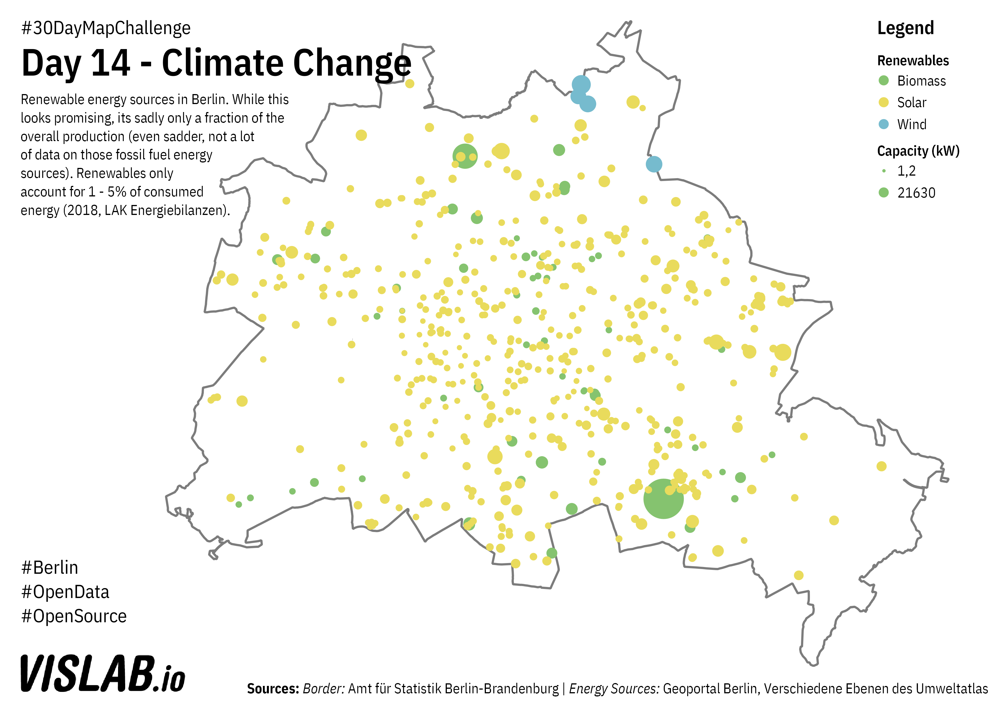

# Day 14 - Raster
Renewable energy in Berlin.

## Sources

### Infrared Imagery

https://fbinter.stadt-berlin.de/fb/wfs/data/senstadt/s08_07_1anlagen11bimschv
https://fbinter.stadt-berlin.de/fb/wfs/data/senstadt/s_biom_anlbis30kw
https://fbinter.stadt-berlin.de/fb/wfs/data/senstadt/s_biom_anlgr30kw
https://fbinter.stadt-berlin.de/fb/wfs/data/senstadt/s_wind_standort
https://fbinter.stadt-berlin.de/fb/wfs/data/senstadt/s08_09_01_ortbis30kw
https://fbinter.stadt-berlin.de/fb/wfs/data/senstadt/s08_09_01_ortab30kw

Geoportal Berlin / Various Layers from (Umweltatlas)
