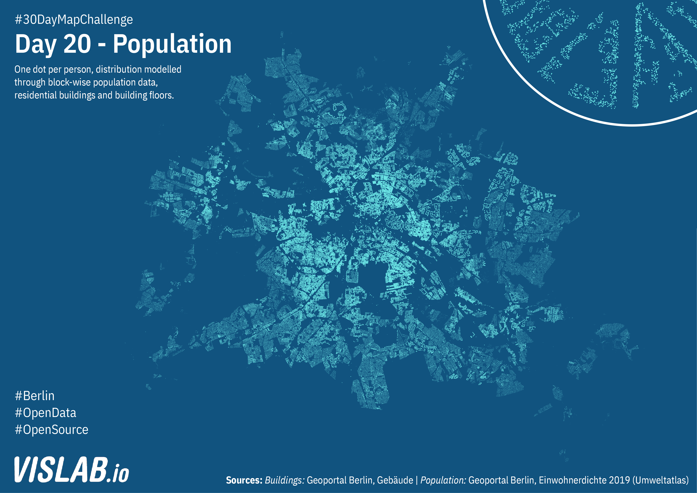

# Day 20 - Population
Berlin's population from blocks distributed onto buildings using postgresql and QGIS.



## SQL Queries

```
DELETE FROM buildings WHERE gebaeudefu NOT IN (1000, 1010, 1020, 1021, 1022, 1023, 1024, 1100, 1110, 1120, 1130, 1210, 1220);
ALTER TABLE buildings ADD COLUMN factor numeric DEFAULT 1.0;
UPDATE buildings SET factor = 0.5 WHERE gebaeudefu IN (1100, 1110, 1120, 1130, 1210, 1220);
ALTER TABLE population ADD column building_area numeric DEFAULT 0;

ALTER TABLE buildings ADD column geom_fixed geometry('MultiPolygon', 25833)
ALTER TABLE population ADD column geom_fixed geometry('MultiPolygon', 25833)

UPDATE population SET geom_fixed = ST_Multi(ST_Buffer(geom, 0))
UPDATE buildings SET geom_fixed = ST_Multi(ST_Buffer(geom, 0))

CREATE INDEX idx_buildings_geom_fixed ON buildings USING GIST (geom_fixed)
CREATE INDEX idx_population_geom_fixed ON population USING GIST (geom_fixed)

UPDATE
	population
SET
	building_area = temp.area
FROM
(
	SELECT 
		SUM(
				ST_Area(ST_Intersection(
					population.geom_fixed,
					buildings.geom_fixed
				))
			* buildings.anzahldero
			* buildings.factor
		) AS area,
		population.id AS id
	FROM
		population
	JOIN 
		buildings
	ON
		ST_Intersects(buildings.geom_fixed, population.geom_fixed)
	GROUP BY
		population.id
) AS temp
WHERE
	temp.id = population.id

ALTER TABLE buildings ADD COLUMN population numeric DEFAULT 0

UPDATE
	buildings
SET
	population = temp.population
FROM
(
	SELECT
		SUM(
			(ST_Area(ST_Intersection(buildings.geom_fixed, population.geom_fixed)) * buildings.anzahldero) / population.building_area * population.ew2019
		) AS population,
		buildings.id
	FROM
		buildings
	JOIN
		population
	ON
		ST_Intersects(buildings.geom_fixed, population.geom_fixed)
	GROUP BY
		buildings.id
) AS temp
WHERE
	buildings.id = temp.id

```

## Sources

### Buildings data
https://opendata-esri-de.opendata.arcgis.com/datasets/ecf431fd8c394ee1b2fd7d54563e7b81_0
Geoportal Berlin, Hausumrisse

### Population data
https://fbinter.stadt-berlin.de/fb/wfs/data/senstadt/s06_06ewdichte2019
Geoportal Berlin, Einwohnerdichte 2019