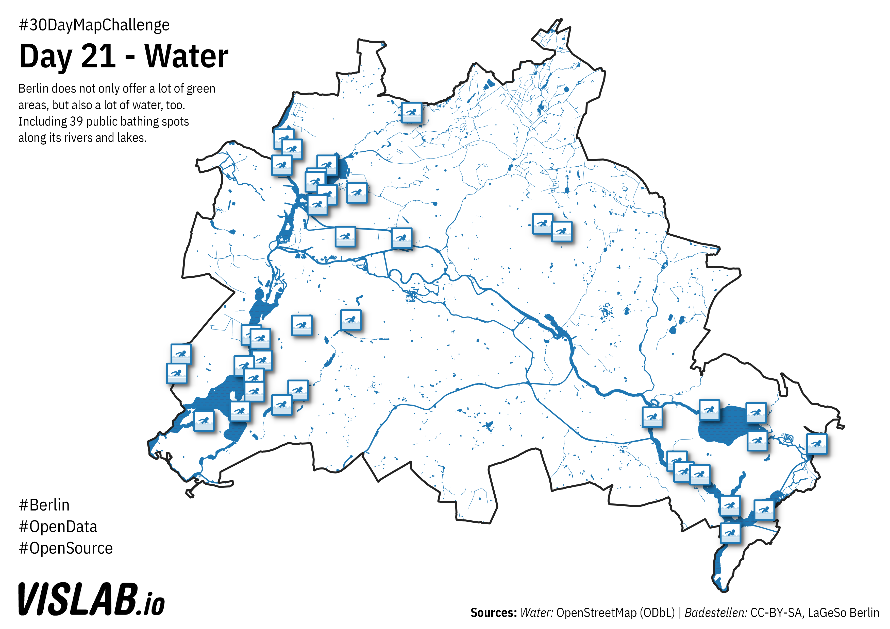

# Day 21 - Water
Landuse classification in Berlin

## Sources

### Water bodies

OpenStreetMap (ODbL)

### Bathing Spots

https://daten.berlin.de/datensaetze/liste-der-badestellen
CC-BY-SA, LaGeSo Berlin