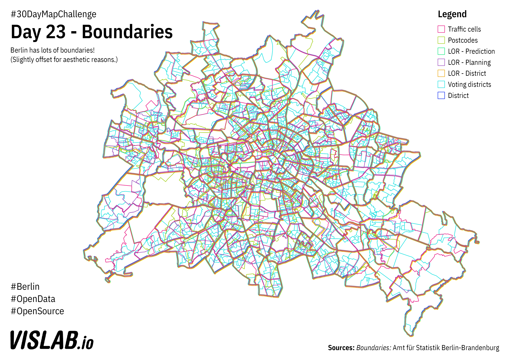

# Day 23 - Boundaries
Berlin has lots of different boundaries: administrative, statistical, political 

## Sources

### Boundaries

LORs, WFS: https://fbinter.stadt-berlin.de/fb/wfs/data/senstadt/s_lor_bez, CC-BY-3.0: Amt für Statistik Berlin-Brandenburg

Postcodes, WFS: https://fbinter.stadt-berlin.de/fb/wfs/data/senstadt/s_plz, CC-BY-3.0: Amt für Statistik Berlin-Brandenburg

Statistical districts (traffic cells), WFS: https://fbinter.stadt-berlin.de/fb/wfs/data/senstadt/s_vz, DL-DE-BY-2.0: Geoportal Berlin, Verkehrszellen

Districts, Shapefile: https://www.statistik-berlin-brandenburg.de/opendata/RBS_OD_BEZ_2016_12.zip, CC-BY-3.0: Amt für Statistik Berlin-Brandenburg

Voting Districts: Shapefile: https://www.statistik-berlin-brandenburg.de/opendata/RBS_OD_UWB_EU2019.zip, CC-BY-3.0: Amt für Statistik Berlin-Brandenburg
