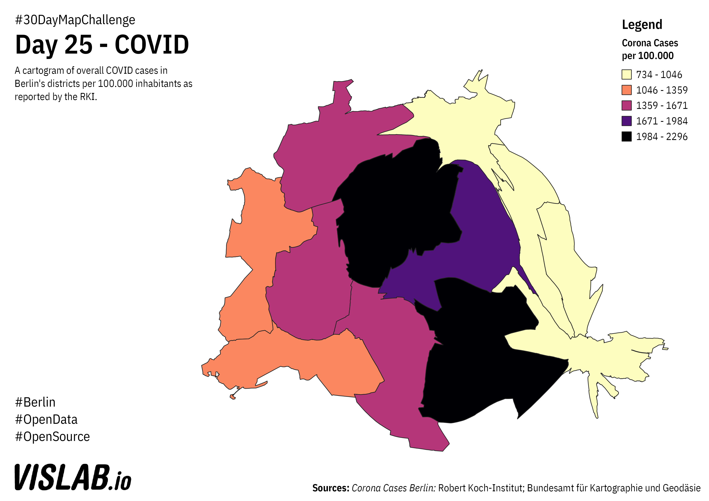

# Day 25 - COVID
Overall COVID cases per 100.000 citizens per district in a cartogram 

## Sources

### COVID Data

https://npgeo-corona-npgeo-de.hub.arcgis.com/datasets/dd4580c810204019a7b8eb3e0b329dd6_0
Robert Koch Institut, Bundesamt für Kartographie und Geodäsie