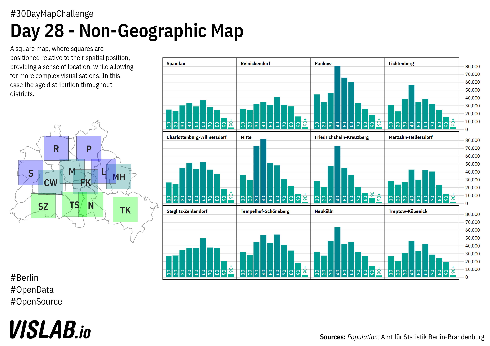

# Day 28 - Non-Geographic Map
A square map of districts, with population-age distributions in each square.

## Sources

### Data

https://www.statistik-berlin-brandenburg.de/webapi/jsf/tableView/tableView.xhtml
Einwohnerregister, Amt für Statistik Berlin-Brandenburg

## Related Project
Build your own square maps:
https://github.com/sebastian-meier/nmap.js
https://github.com/sebastian-meier/nmap-squared.js
https://github.com/sebastian-meier/d3.geo2rect