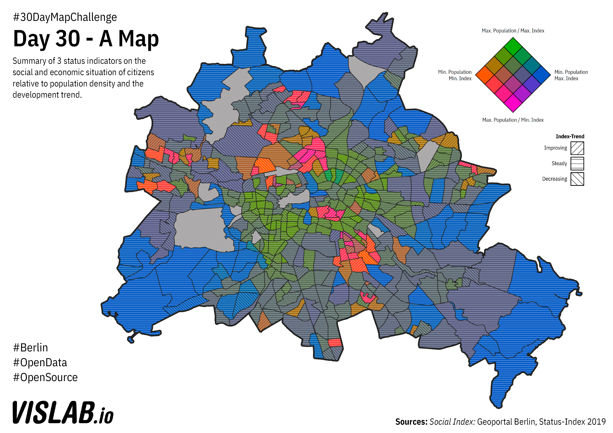

# Day 30 - A map
I multivariate map visualizing socio-economic index with population density and the trend of the index.
The legend is build with D3js.

## Sources

### Social Index
https://fbinter.stadt-berlin.de/fb/wfs/data/senstadt/s_Indizes_MSS2019
Geoportal Berlin, Monitoring Soziale Stadtentwicklung 2019: Indizes
